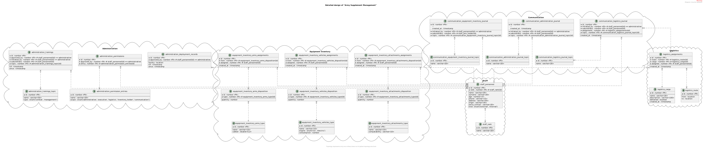

# ArmySupplementManagement

## General Information

An army supplement management database topology, which describes main army management structure for one exact military base out of the external topology context.

In order to gain isolation of data and receive logical separation to have scalability feature, all the top-tier structures are separated into logical databases.

The usage of database per instance approach gives an opportunity to allocate system resources specific to each database.

## Databases(logical)

* 

## Entity

* 