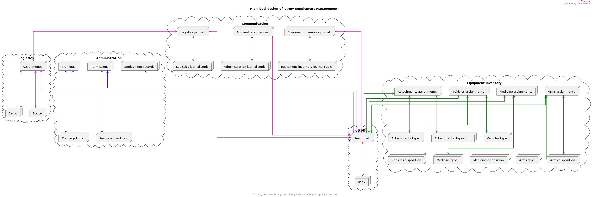
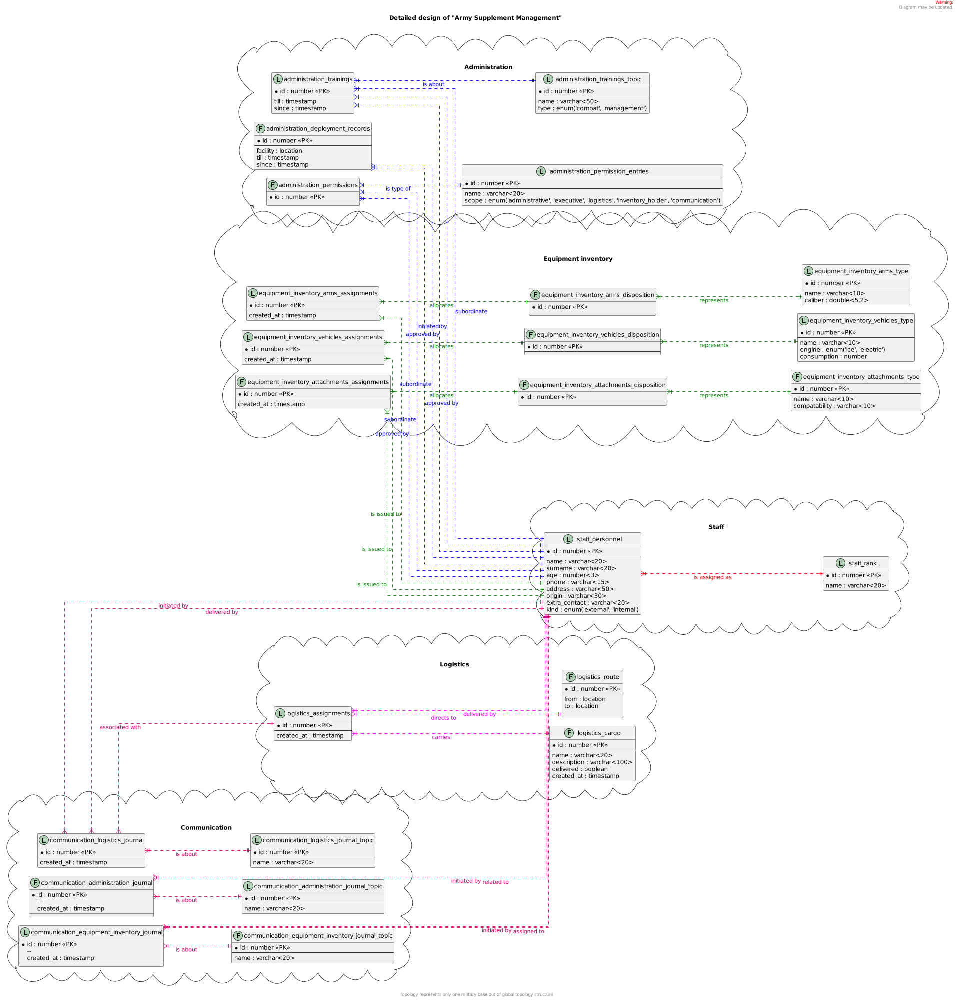

# ArmySupplementManagement

## General Information

An army supplement management database topology, which describes main army management structure for one exact military base out of the external topology context.

In order to gain logical isolation of data all the top-tier structures are separated by prefix.

> As the future update namespaces can be separated into different clusters using replication mechanism. The usage of namespace per instance approach gives an opportunity to allocate system resources specific to each database(namespace).

## Namespace

* **Staff**
  * Represents data related to military personnel. 
* **Equipment inventory**
  * Represents all the inventory related data, including different type of stuff, which can be assigned to military personnel.
* **Logistics**
  * Represents set of data related to logistics operations, including assignments, available routes and registered cargo.
* **Administration**
  * Represents data related to administrated activities, including deployment and training records, granted permissions. 
* **Communication**
  * Represents list of journals related to administration, logistics and equipment inventory

## Entity

* **staff_personnel**
  * Represents military staff personal details
* **staff_rank**
  * Represents all the available military ranks
* **equipment_inventory_arms_assignments**
  * Represents all the declared arms inventory allocation assignments
* **equipment_inventory_arms_disposition**
  * Represents all the available arms for disposition in the inventory
* **equipment_inventory_arms_type**
  * Represents all the available arms kinds in the inventory
* **equipment_inventory_vehicles_assignments**
  * Represents all the declared vehicles inventory allocation assignments
* **equipment_inventory_vehicles_disposition**
  * Represents all the available vehicles for disposition in the inventory
* **equipment_inventory_vehicles_type**
  * Represents all the available vehicles kinds in the inventory
* **equipment_inventory_attachments_assignments**
  * Represents all the declared attachments inventory allocation assignments 
* **equipment_inventory_attachments_disposition**
  * Represents all the available attachments for disposition in the inventory
* **equipment_inventory_attachments_type**
  * Represents all the available attachments kinds in the inventory
* **logistics_assignments**
  * Represents all the declared logistics assignments
* **logistics_route**
  * Represents logistics route
* **logistics_cargo**
  * Represents logistics cargo
* **communication_logistics_journal**
  * Represents all the log records related to logistics operations
* **communication_logistics_journal_topic**
  * Represents all the possible log topics used by logistics related operations
* **communication_administration_journal**
  * Represents all the log records related to administrative operations
* **communication_administration_journal_topic**
  * Represents all the possible log topics used by administrative related operations
* **communication_equipment_inventory_journal**
  * Represents all the log records related to equipment inventory operations
* **communication_equipment_inventory_journal_topic**
  * Represents all the possible log topics used by equipment inventory related operations
* **administration_trainings**
  * Represents all the details related to trainings initiated for subordinate military personnel 
* **administration_trainings_topic**
  * Represents all the possible training topics
* **administration_deployment_records**
  * Represents all the personnel deployment details
* **administration_permissions**
  * Represents all the granted permissions for military personnel
* **administration_permission_entries**
  * Represents all the possible kinds of permissions, which can be granted

## Relation

* _staff_personnel_ **zero or many to zero or many** _staff_rank_
* _equipment_inventory_arms_assignments_ **zero or many to zero or many** _equipment_inventory_arms_disposition_
* _equipment_inventory_arms_assignments_ **zero or many to zero or many** _staff_personnel_
* _equipment_inventory_arms_disposition_ **zero or many to exactly one** _equipment_inventory_arms_type_
* _equipment_inventory_vehicles_assignments_ **zero or many to zero or many** _equipment_inventory_vehicles_disposition_
* _equipment_inventory_vehicles_assignments_ **zero or many to zero or many** _staff_personnel_
* _equipment_inventory_vehicles_disposition_ **zero or many to exactly one** _equipment_inventory_vehicles_type_
* _equipment_inventory_attachments_assignments_ **zero or many to zero or many** _equipment_inventory_attachments_disposition_
* _equipment_inventory_attachments_assignments_ **zero or many to zero or many** _staff_personnel_
* _equipment_inventory_attachments_disposition_ **zero or many to exactly one** _equipment_inventory_attachments_type_
* _logistics_assignments_ **zero or many to zero or many** _logistics_route_
* _logistics_assignments_ **zero or many to exactly one** _logistics_cargo_
* _logistics_assignments_ **zero or many to zero or many** _staff_personnel_
* _communication_logistics_journal_ **zero or many to zero or many** _logistics_assignments_
* _communication_logistics_journal_ **zero or many to zero or many** _communication_logistics_journal_topic_
* _communication_logistics_journal_ **zero or many to zero or many** _staff_personnel_
* _communication_administration_journal_ **zero or many to zero or many** _communication_administration_journal_topic_
* _communication_administration_journal_ **zero or many to zero or many** _staff_personnel_
* _communication_equipment_inventory_journal_ **zero or many to zero or many** _communication_equipment_inventory_journal_topic_
* _communication_equipment_inventory_journal_ **zero or many to zero or many** _staff_personnel_
* _administration_trainings_ **zero or many to zero or many** _staff_personnel_
* _administration_trainings_ **zero or many to zero or many** _administration_trainings_topic_
* _administration_deployment_records_ **zero or many to zero or many** _staff_personnel_
* _administration_permissions_ **zero or many to zero or many** _staff_personnel_
* _administration_permissions_ **zero or many to zero or many** _administration_permission_entries_